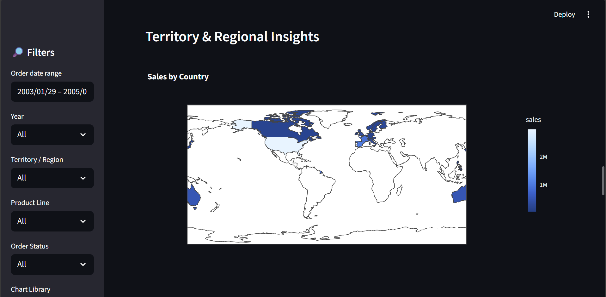
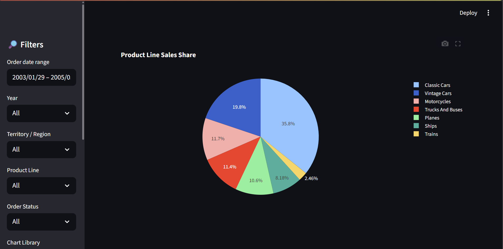

# 📊 Sales Insights Dashboard

A data-driven **interactive dashboard** built using **Python, Streamlit, SQL, and MySQL** to analyze and visualize sales data.
The project extracts data from a MySQL database, processes it with Pandas, and generates insights with visualizations.

---

## 📁 Project Structure

```
Sales Insights DashBoard
|
│── .ipynb_checkpoints/
|   ├── requirements-checkpoint.txt
│
│── .venv/
│   ├── etc/
│   ├── Include/
│   ├── Lib/
│   ├── Scripts/
│   ├── share/
│   ├── .gitignore
│   ├── pyvenv.cfg
│
│── apps/
│   ├── __pycache__/
│   ├── __init__.py
│   └── streamlit_app.py
│
│── data/
│   ├── .ipynb_checkpoints/
│   ├── cleaned_sales_data.csv
│   ├── eda_summary_stats.csv
│   └── sales_data.csv
│
│── notebooks/
│   ├── .ipynb_checkpoints/
│   ├── EDA_on_Cleaned_Data.ipynb
│   └── Initial_Inspection_&_Data_Cleaning.ipynb
│
│── scripts/
│   ├── __pycache__/
│   ├── __init__.py
│   └── test_db_connection.py
│
│── src/
│   ├── __pycache__/
│   ├── __init__.py
│   └── db_connection.py
│
│── .env
│── detail.xlsx
├── README.md
│── requirements.txt
│── myQueries.sql

```

---

## 🚀 Features

- 📌 **Interactive Dashboard** – Built with Streamlit for filtering & visualization
- 📌 **Database Integration** – Connects to MySQL for querying sales data
- 📌 **Data Cleaning & EDA** – Jupyter notebooks for preprocessing & analysis
- 📌 **Key Metrics & KPIs** – Revenue, top-selling products, regional trends
- 📌 **Custom Queries** – SQL queries for flexible insights

---

## ⚙️ Installation & Setup

### 1. Clone the Repository

```bash
git clone https://github.com/rohitraut1024/Sales_Insights_DashBoard.git
cd Sales_Insights_Dashboard
```

### 2. Create Virtual Environment
```bash
python -m venv .venv
source .venv/bin/activate    # On Linux/Mac
.venv\Scripts\activate       # On Windows
```

### 3. Install Dependencies
```bash
pip install -r requirements.txt
```

### 4. Configure Environment Variables
Create a `.env` file in the root directory:

```
MYSQL_HOST=localhost
MYSQL_PORT=3306             # Default
MYSQL_USER=root
MYSQL_PASSWORD=yourpassword
MYSQL_DB=sales_insights
MYSQL_POOL_SIZE=5
MYSQL_CONNECT_TIMEOUT=10

```

### 5. Setup MySQL Database

- Import the `sales_data.csv` into your MySQL database table.
- Ensure DB credentials match `.env`.


### 6. Run the Dashboard
```bash
streamlit run apps/streamlit_app.py
```

---

## 📊 Example Dashboard



---


---

## 📈 Tech Stack
- **Python** (Pandas, Matplotlib, Streamlit)
- **SQL / MySQL**
- **Jupyter Notebooks**
- **dotenv** for environment variables

---

## 🔮 Future Improvements
- Add **multi-page dashboard** (Streamlit pages)
- Include **real-time data updates** from DB
- Deploy on **Streamlit Cloud / Heroku / Docker**

---

## 👨‍💻 Author
**Rohit Raut**
📧 rohitraut78253@gmail.com
🔗 www.linkedin.com/in/rohitraut1024
